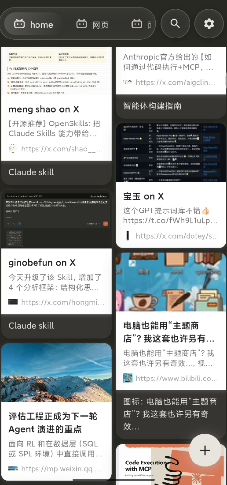
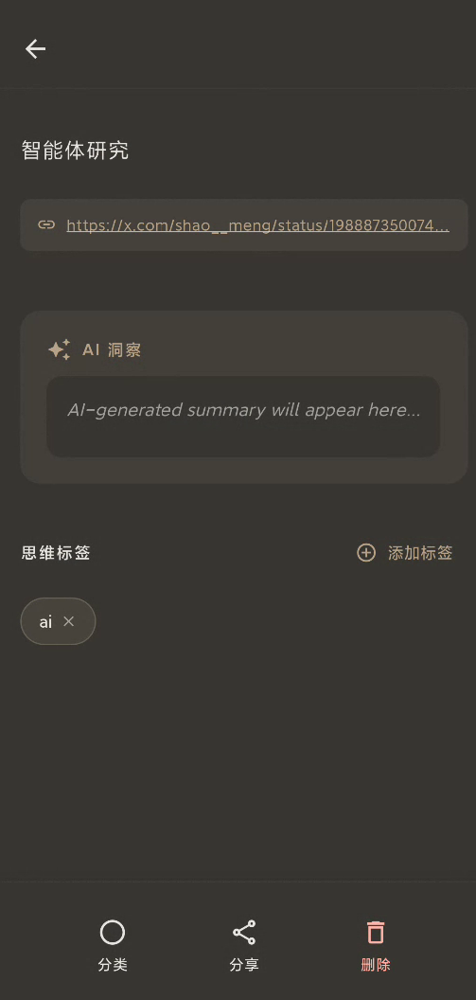

<div align="center">

# 🧠 PocketMind
### 无感收藏，灵感汇聚之处
Your Second Brain, One Tap Away.

[](https://flutter.dev)
[](https://spring.io/projects/spring-ai)
[]()
[](https://creativecommons.org/licenses/by-nc-sa/4.0/)

[功能特性] • [快速开始] • [开发初衷]

</div>

---

## 💥 不要让你的收藏夹一直吃灰”

**你是否经历过这样的时刻？**

* 在 B站 收藏了教程，在 小红书 点赞了攻略，在 浏览器 保存了文章……
* **但是**，当你真正需要用到它们时，却想不起来到底把它“丢”在了哪个 App 的角落里。
* 为了保存一个链接，你需要复制、切换 App、粘贴、保存……繁琐的操作让你最终选择了放弃。

**如果不去回顾，收藏就毫无意义。**

**PocketMind** 的诞生就是为了终结这种碎片化的混乱。它不仅仅是一个书签工具，更是你数字生活的**中央处理器**。无需跳出当前应用，无需繁琐操作，一个“转发”，万物归一。

---

## ✨ 核心魔法

### 🚀 1. 极致的无感记录
不需要复制链接，不需要打开 PocketMind。
在任何 App (Bilibili, 小红书, X...) 中点击 **“分享”** -> 选择 **PocketMind**。
这就是全部。在后台，PocketMind已经为您解析了标题、封面和摘要。

> *⚡️ Be lazy. Just share it.*

### 🎨 2. 赏心悦目的记忆流
告别枯燥的列表。PocketMind 采用**瀑布流** 设计。
您的每一次收藏都以精美的图文卡片呈现，浏览笔记不再是查找资料，而是一种视觉享受。

### 🧠 3. AI 驱动的第二大脑 (Coming Soon)
*这不仅仅是一个存储容器。* 我们正在构建基于 **Spring AI Alibaba** 的智能后端：
* **自动摘要**：太长不看？AI 帮你总结核心要点。
* **智能关联**：自动发现你笔记之间的隐形联系。
* **主动提醒**：基于你的喜好，在合适的时间唤醒沉睡的记忆。

---

## 📱 预览
### 如何快速分享（两种方式分享）？

如果没有提供直接分享到应用入口的app（如小红书）可以添加分享到 PocketMind 的快捷方式，复制链接后点击进行分享即可：

https://github.com/user-attachments/assets/7e0ad71e-72d5-4eb4-a518-f76e96105b41

如果提供了分享链接到应用的app，可以直接选择 PocketMind 即可分享啦：

https://github.com/user-attachments/assets/85860a47-1291-40d2-8380-09b5f2d94775

| 瀑布流主页 | 搜索 | 详情 |
|:---:|:---:|:---:|
|  |  |  |

---
> 目前只支持 Android ，没有苹果设备无法适配😭
## 当前计划
1. 完善 AI 的支持
2. 添加智能的提醒功能
3. 增加 win 的适配，处理数据的传输
4. 美化ui
## 开发初衷
大概是懒癌后期😱，在X，微信公众号，B站，小红书等app查看一些文章的时候，总是收藏了但是需要的时候确不知道再哪一个app收藏夹里面了，并且也经常吃灰😥。

PocketMind 是我对自己数字生活的一次重构，一次不一样的尝试。

目前项目还在早期开发阶段，AI 分析和任务提醒功能正在紧锣密鼓地施工中。如果你也厌倦了收藏夹的混乱和搜藏无用，欢迎 Star 关注，见证它的成长。

## 🛠️ 快速上手 (Get Started)

PocketMind 包含移动端 (Mobile) 和 后端 (Backend) 两部分。

### 前置要求
* **Flutter SDK**: `^3.8.1`
* 可以运行 flutter 项目的编辑器
* **JDK**: `17+`

### 运行 App
```Bash
cd mobile
flutter pub get
flutter run
```

#### 项目架构
mobile/lib/
├── api/                 # 网络 API 服务 (Dio 封装)
│   ├── note_api_service.dart
│   └── link_preview_api_service.dart
├── data/                # 数据层 (Repositories 实现 & Mappers)
│   ├── repositories/    # Isar 数据库操作实现
│   └── mappers/         # DTO 与 Entity 转换
├── domain/              # 领域层 (Entities & Repository 接口)
├── model/               # Isar 数据模型 (生成的 .g.dart 文件)
│   ├── note.dart        # 笔记模型
│   └── category.dart    # 分类模型
├── page/                # UI 页面与组件
│   ├── home/            # 主页相关 (HomeScreen, NoteDetail)
│   ├── share/           # 分享扩展页面 (EditNotePage, ShareSuccessPage)
│   └── widget/          # 通用组件 (GlassNavBar, LinkPreviewCard)
├── providers/           # Riverpod Providers (状态管理定义)
├── util/                # 工具类 (UrlHelper, Theme, Config)
├── main.dart            # 主应用入口
└── main_share.dart      # 分享扩展入口
mobile/Android/
├── src/                 
    ├── ShareActivity.kt # 与flutter层面的分享交互
    └── MainActivity.kt  
    └── MyQSTileService.kt  # 与QSTile层面的分享交互
### 1. 启动后端（还在开发中，目前不启动也没关系）
后端负责 AI 解析。

```bash
cd backend
./mvnw spring-boot:run
```
